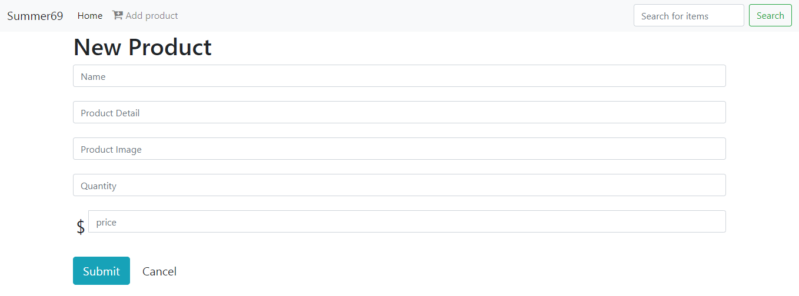
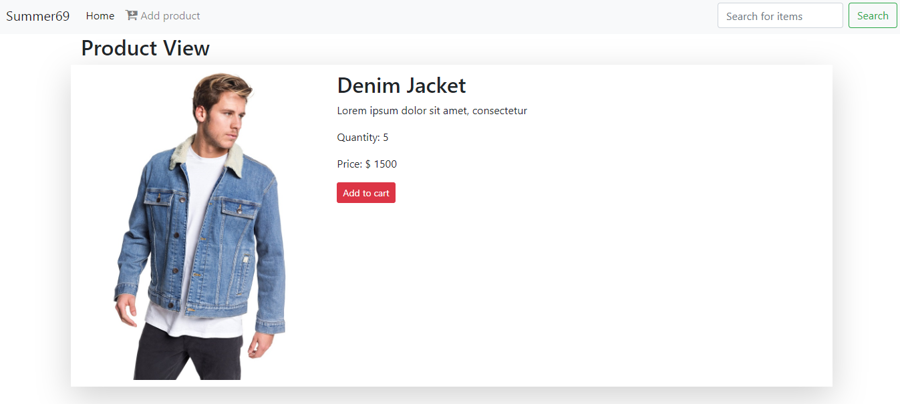
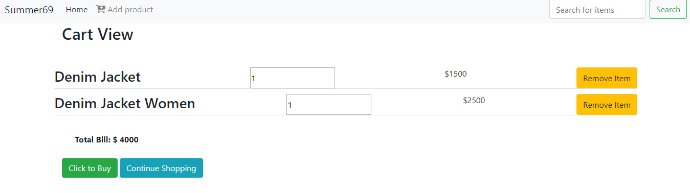

# Assignment-1-Ecommerce
This is a project of an offline ecommerce website "Summer69" with the basic functionalities using:
1. HTML
2. CSS
3. Javascript
4. Jquery
5. Bootstrap Library

## Functionalities
The functionalities include: 
1. A Home page with several cards of products in the system
2. Users can add a product to the system through a form page
3. The Home page will be updated with the new product
4. Users can buy products by adding a product to their cart
5. On clicking the image users can view the selected products information
6. On clicking the cart, the items selected on the cart will be previwed.
7. Items can be removed from the cart 
8. A total bill will be generated by the number of items selected on the cart

## Pages
There are several HTML pages included:
* Home page

    It includes all the items in the system. It shows it in cards which are generated using the bootstrap library. The backend work is carried out by a javascript file. 

    

    -Product View
    

* Form Page

    A form is used to add new products to the system for the users. 

   
* Single View Page

    This page displays information of the product selected. It only triggers if the image of the product is clicked

    

* Cart View

    This page displays the information of the items selected on the cart and the total price of the products selected.  

    

